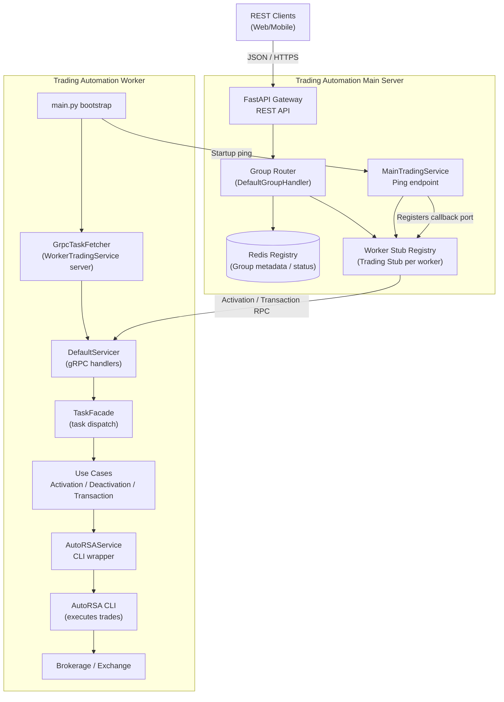

# Trading Automation Worker

A distributed worker node component for the Trading Automation system that executes trading tasks via gRPC communication with the main server.

## System Architecture

This project is part of a distributed trading automation system consisting of two main components:

- **[Trading-Automation-Main](https://github.com/roieGolst/Trading-Automation-Main)**: Central server that coordinates worker nodes, provides REST API, and manages account information
- **Trading-Automation-Worker**: This worker node that executes trading tasks and communicates with the main server via gRPC

## Connection Between Projects

The worker connects to the main server through:
1. **gRPC Communication**: Bidirectional communication using protocol buffers
2. **Ping/Pong**: Initial connection establishment with the main server
3. **Task Execution**: Receives and processes trading tasks (activation, deactivation, transactions)

## Worker Communication Flow

The diagrams below highlight how client calls propagate through the main server into the worker and back:

1. **Registration**: Worker starts, pings `MainTradingService`, and publishes its callback port
2. **Task Reception**: Main server forwards activation/deactivation/transaction RPCs through the worker stub
3. **Task Execution**: `TaskFacade` routes tasks to the proper use case and into `AutoRSAService`
4. **Response Handling**: The worker returns success/error payloads via gRPC

### Worker Communication Flow (Mermaid)



### Worker Communication Flow (ASCII)

<details>
<summary>Expanded ASCII overview</summary>

```
                                    ┌─────────────────────────────┐
                                    │         REST Clients        │
                                    └────────────┬────────────────┘
                                                 │ HTTPS JSON
                                                 ▼
           ┌────────────────────────────────────────────────────────────────┐
           │               Trading Automation Main Server                   │
           │----------------------------------------------------------------│
           │ FastAPI Layer                                                  │
           │  - validates payloads & enforces auth                          │
           │  - normalises trading intents                                  │
           │                                                                │
           │ DefaultGroupHandler / Router                                   │
           │  - locates worker stubs per account group                      │
           │  - persists routing data & creds via Redis                     │
           │                                                                │
           │ Worker Stub Registry (Trading Stub)                            │
           │  - maintains gRPC channels to each worker                      │
           │  - forwards Activation / Deactivation / Transaction RPC        │
           │                                                                │
           │ MainTradingService (Ping)                                      │
           │  - receives worker startup pings                               │
           │  - records callback host:port for routing                      │
           └───────────────────────┬────────────────────────────────────────┘
                                   │ secure gRPC
                                   ▼
          ┌──────────────────────────────────────────────────────────────────┐
          │                 Trading Automation Worker                        │
          │------------------------------------------------------------------│
          │ main.py bootstrap                                                │
          │  - loads configs & logger                                        │
          │  - builds GrpcTaskFetcher                                        │
          │  - wires TaskFacade with DefaultTaskHandler                      │
          │                                                                  │
          │ GrpcTaskFetcher / WorkerTradingService                           │
          │  - starts gRPC server & registers DefaultServicer                │
          │  - pings MainTradingService to advertise callback port           │
          │                                                                  │
          │ DefaultServicer                                                  │
          │  - converts inbound proto tasks -> internal Task models          │
          │  - delegates to TaskFacade.on_task                               │
          │                                                                  │
          │ TaskFacade                                                       │
          │  - routes task types -> specific use cases                       │
          │                                                                  │
          │ Use Cases (Activation/Deactivation/Transaction)                  │
          │  - execute AutoRSA operations                                    │
          │  - build Response payloads                                       │
          │                                                                  │
          │ AutoRSAService                                                   │
          │  - manages .env credentials & runs AutoRSA CLI                   │
          │  - returns stdout / errors back to gRPC caller                   │
          └──────────────────────────────────────────────────────────────────┘
```

</details>


## Goals & Features

### Primary Goals
- Execute trading tasks received from the main server
- Manage brokerage account activation/deactivation
- Process buy/sell transactions using the AutoRSA trading tool
- Maintain reliable gRPC communication with the main server

### Key Features
- **Task Processing**: Handles activation, deactivation, and transaction tasks
- **AutoRSA Integration**: Wraps the AutoRSA CLI tool for actual trading operations
- **Environment Management**: Manages account credentials and configurations
- **Containerized Deployment**: Docker support with multi-Python environment setup
- **Logging**: Comprehensive logging for monitoring and debugging

## Prerequisites

### System Requirements
- Python 3.9+ (for worker functionality)
- Python 3.12 (for AutoRSA CLI tool)
- Docker (for containerized deployment)
- Git

### Dependencies
- **Core**: `grpcio`, `grpcio-tools` for gRPC communication
- **Type Support**: `typing-extensions`, `mypy-protobuf`
- **Protocol Buffers**: `protoletariat` for protobuf processing

### External Tools
- **AutoRSA**: Trading automation CLI tool (included as submodule)
- **Redis**: Required by the main server (not directly used by worker)

## Installation & Setup

### Local Development

1. **Clone the repository**
   ```bash
   git clone <repository-url>
   cd Trading-Automation-Worker
   ```

2. **Install Poetry** (if not already installed)
   ```bash
   curl -sSL https://install.python-poetry.org | python3 -
   ```

3. **Install dependencies**
   ```bash
   poetry install
   ```

4. **Build protocol buffers**
   ```bash
   ./scripts/proto_build.sh
   ```

5. **Build AutoRSA tool**
   ```bash
   ./scripts/build_auto_rsa.sh
   ```

6. **Configure application**
   Create `configs/app.json` with:
   ```json
   {
     "MAIN_SERVER_HOST": "localhost",
     "MAIN_SERVER_PORT": 8080,
     "TASK_FETCHER_HOST": "0.0.0.0",
     "TASK_FETCHER_PORT": 50051
   }
   ```

### Docker Deployment

1. **Build Docker image**
   ```bash
   docker build -t trading-worker .
   ```

2. **Run container**
   ```bash
   docker run -d --name trading-worker \
     -p 50051:50051 \
     -v $(pwd)/configs:/app/configs \
     trading-worker
   ```

## Configuration

### Application Configuration (`configs/app.json`)
- `MAIN_SERVER_HOST`: Main server hostname/IP
- `MAIN_SERVER_PORT`: Main server gRPC port
- `TASK_FETCHER_HOST`: Worker's listening host
- `TASK_FETCHER_PORT`: Worker's listening port

### Environment Configuration
- AutoRSA configurations are managed in `./lib/auto-rsa/.env`
- Account details are dynamically added/removed during activation/deactivation

## Usage

### Starting the Worker

**Local:**
```bash
poetry run python app/main.py
```

**Docker:**
```bash
docker run trading-worker
```

### Task Processing

The worker automatically:
1. Connects to the main server via gRPC
2. Registers itself by sending a ping
3. Listens for incoming tasks
4. Executes tasks using the appropriate services
5. Returns results to the main server

### Supported Task Types

1. **Activation Tasks**: Add new brokerage accounts
2. **Deactivation Tasks**: Remove brokerage accounts
3. **Transaction Tasks**: Execute buy/sell orders

## Project Structure

```
app/
├── main.py                 # Application entry point
├── bootstrap.py            # Application bootstrap logic
├── logger.py              # Logging configuration
├── taskFacade/            # Task handling abstraction
├── data/
│   ├── model/task/        # Task data models
│   └── strategy/grpc/     # gRPC implementation and protobuf files
└── services/
    └── autoRsaService/    # AutoRSA integration service

configs/                   # Configuration files
scripts/                   # Build and setup scripts
lib/auto-rsa/             # AutoRSA CLI tool (submodule)
```

## Development

### Building Protocol Buffers
```bash
./scripts/proto_build.sh
```

### Running Tests
```bash
poetry run pytest
```

### Code Style
```bash
poetry run black app/
poetry run flake8 app/
```

## Troubleshooting

### Common Issues

1. **Connection Failed**: Ensure main server is running and accessible
2. **AutoRSA Errors**: Check Python 3.12 installation and AutoRSA setup
3. **Port Conflicts**: Verify gRPC port availability
4. **Permission Errors**: Ensure proper file permissions for scripts

### Logs
Check application logs for detailed error information and debugging.

## Contributing

1. Fork the repository
2. Create a feature branch
3. Make changes and add tests
4. Ensure all tests pass
5. Submit a pull request

## License

[License information to be added]

## Related Projects

- [Trading-Automation-Main](https://github.com/roieGolst/Trading-Automation-Main) - Central coordination server
